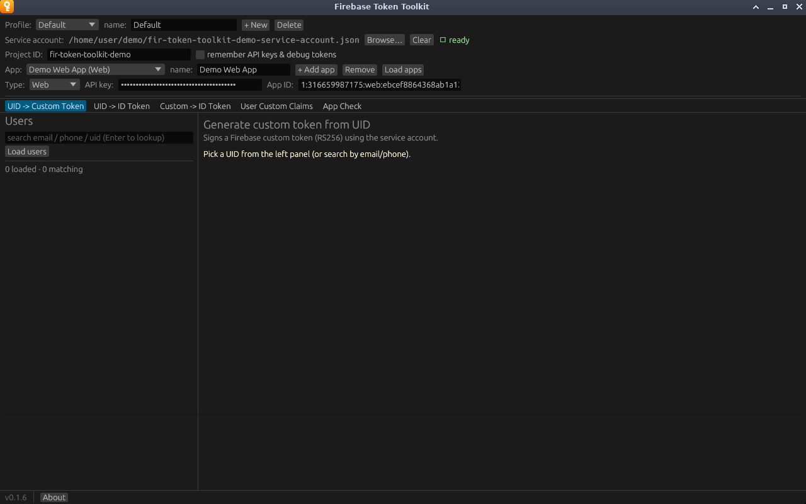
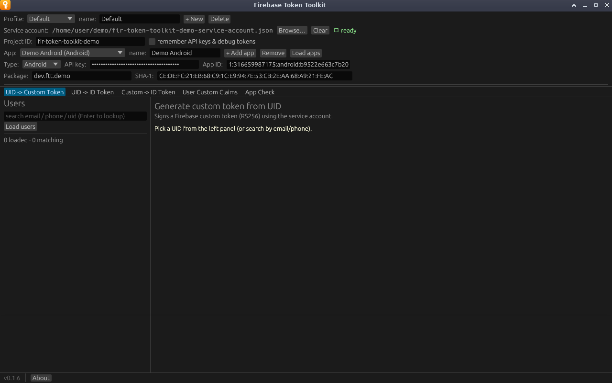

# The top bar

Everything the tabs need comes from the top bar. Its values belong to the
active [profile](profiles.md), so switching profiles swaps them all at once.
The first rows hold the profile and service account; the last two hold the
selected [app](#apps).

## Service account

**Browse…** opens a file chooser for the service-account JSON key. When the key
loads, a green *Service account loaded* message appears, and if **Project ID**
is empty it is filled in from the key.

**Clear** unloads the key and clears the selected user. It also clears
**Project ID**, but only if the key filled that value in and you have not
edited it since.

The app stores the file's path, not its contents, and reads the key again on
every launch. If the file has moved, the profile starts with no service
account loaded.

## Status indicator

The indicator to the right of the service account shows what the app can do
right now:

| Indicator | Meaning | Tabs available |
|---|---|---|
| **not configured** (red) | No service account loaded | *Custom -> ID Token* and *App Check* only, given an app with an API key |
| **SA only** (yellow) | Service account loaded, the selected app has no API key | *UID -> Custom Token*, *User Custom Claims*, the Users panel |
| **ready** (green) | Service account, and the selected app has an API key | All tabs (*App Check* also needs the app's App ID) |

## Project ID

The Firebase project ID, for example `fir-token-toolkit-demo`. The Users panel,
User Custom Claims and App Check use it to build their requests. It normally
comes from the key file, but you can edit it.

## remember API keys & debug tokens

Off by default. When ticked, every app's API key and App Check debug token are
saved to disk in plaintext, for **every** profile. When unticked, they are kept
in memory only and cleared from every profile the next time the app saves.
App names, App IDs and the Android and iOS identifiers are always saved: they
are not secret, and they ship inside every build of the app. See
[Settings and storage](reference/settings-storage.md).

## Apps

A profile holds a list of the project's apps, and the tabs that call Google
with an API key (*UID -> ID Token*, *Custom -> ID Token* and *App Check*) use
the one selected in the **App** dropdown.

| Control | What it does |
|---|---|
| **App** dropdown | Selects the app, listed as `name (type)`. Switching clears the output of the three API-key tabs, but not the user list or the other tabs. |
| **name** | Renames the selected app. |
| **+ Add app** | Adds an empty **Web**, **Android** or **iOS** app and selects it. |
| **Remove** | Removes the selected app. Removing the last one leaves an empty web app. |
| **Load apps** | Imports the project's apps from Firebase. Needs the service account and Project ID. |
| **Type** | Web, Android or iOS. Decides which identifying headers go with the API key. |
| **API key** | The key sent with requests for this app. Masked. |
| **App ID** | The app's Firebase App ID. Pasting one sets **Type** to match, and renames an app still carrying a default name such as *Web app*. |
| **Package**, **SHA-1** | Android only: the package name and signing-certificate SHA-1. |
| **Bundle ID** | iOS only. |

**Load apps** matches apps on their App ID, so running it again updates the
list rather than duplicating it. It refreshes each app's type, package, bundle
ID and API key from Firebase, but keeps a name or SHA-1 you changed yourself.

The **Package** and **SHA-1**, or **Bundle ID**, matter only for an API key
restricted to an Android or iOS app; see
[API keys restricted to an app](firebase-setup.md#api-keys-restricted-to-an-app).
A SHA-1 that is not 40 hex digits (colons are fine) is marked *invalid* in
yellow and is not sent.

## Selected UID

Once you pick a user in the [Users panel](guide/users-panel.md), a **Selected
UID** row shows their UID and, in grey, their email or phone and display name.
The UID-based tabs act on this user.
