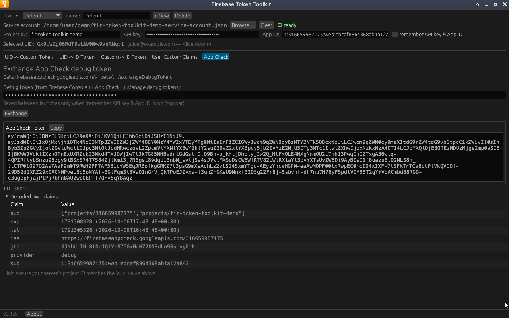

# App Check

Exchanges an [App Check debug token](https://firebase.google.com/docs/app-check/web/debug-provider)
for a real App Check token. Use it to call App Check–protected backends, such
as Cloud Functions or your own server, from scripts or API tools that cannot
run the App Check SDK.

**Needs:** the Project ID, App ID and Web API key from the top bar. No service
account is required.

## Before you start

Register a debug token for your web app in the Firebase console under **App
Check** → **Apps** → ⋮ → **Manage debug tokens**. The steps are in [Preparing
your Firebase project](../firebase-setup.md#app-check-debug-token-app-check-only).

## Exchanging a debug token

1. Paste the debug token into **Debug token**. The field is masked.
2. Click **Exchange**.



The result shows the **App Check Token** with a **Copy** button, its **TTL**
(time to live, set by the app's App Check settings), and the decoded claims.
Send the token in the `X-Firebase-AppCheck` header:

```bash
curl -H "X-Firebase-AppCheck: $APP_CHECK_TOKEN" https://us-central1-<project>.cloudfunctions.net/hello
```

## Checking the audience

The tab ends with a reminder to compare your server's project with the `aud`
claim. App Check tokens list the project by number and by ID, for example
`["projects/316659987175","projects/fir-token-toolkit-demo"]`. A backend
configured for a different project rejects the token.

## Saving the debug token

The debug token belongs to the profile, but like the API key it is saved
between launches only when **remember API key & App ID** is ticked. Otherwise
you paste it again after restarting.

## When the exchange fails

`API error (403): App attestation failed.` almost always means the debug token
is not registered for this App ID. See
[Troubleshooting](../troubleshooting.md#app-check) for other errors.
