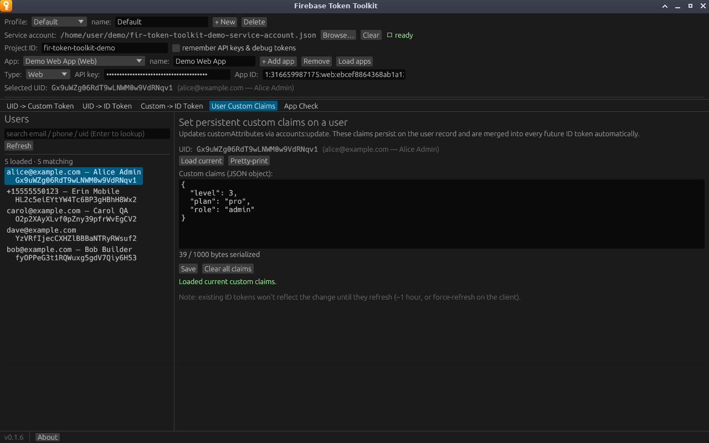
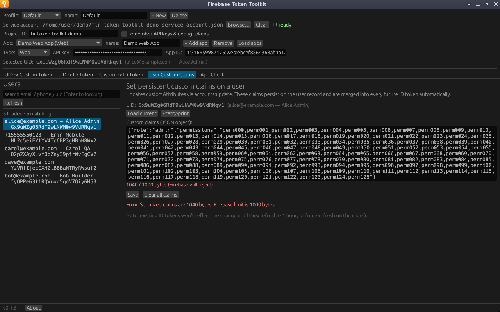

# User Custom Claims

Reads and edits the custom claims stored on a user's record (`customAttributes`
in the Identity Toolkit API). Unlike the claims box on the token tabs, these
are permanent: Firebase adds them to **every** ID token the user gets from now
on, until you change them.

**Needs:** a service account, a Project ID, and a selected user.

## Viewing a user's claims

Select a user and click **Load current**. The editor fills with their claims,
and the message says either *Loaded current custom claims.* or *Loaded — user
has no custom claims set.*

**Pretty-print** reformats the JSON with indentation and sorted keys. If the
JSON is invalid, it reports `Invalid JSON:` and the parser's message instead.

Selecting a different user clears the editor, so you cannot accidentally save
one user's claims onto another.

## Changing claims

1. Click **Load current** so you start from what is stored.
2. Edit the JSON. It must be an object, for example
   `{"role": "admin", "plan": "pro", "level": 3}`.
3. Click **Save**.

The editor replaces the user's claims entirely; it does not merge. Any key you
remove from the JSON is removed from the user.

## The 1,000-byte limit

Firebase rejects claims larger than 1,000 bytes. A counter under the editor
measures the claims compactly serialized, which is how Firebase counts them, so
whitespace from **Pretty-print** does not count:

- grey `39 / 1000 bytes serialized`: within the limit,
- red `1040 / 1000 bytes (Firebase will reject)`: too large; **Save** refuses
  with an error,
- yellow `(invalid JSON — fix before saving)`.

Keep claims small. They travel in every token and every request, and they
suit roles and flags rather than profile data.

## Removing all claims

Saving an empty editor is refused on purpose, to avoid wiping claims by
accident. To remove everything, click **Clear all claims**. It saves an empty
claims object (`{}`), and the message reads *Saved — all custom claims
cleared.* Loading a user whose claims are `{}` shows an empty editor and *Loaded
— user has no custom claims set.*

## When changes take effect

Tokens already issued keep the old claims until they expire, about an hour. A
client can pick up the change sooner by force-refreshing its token, for
example `getIdToken(true)` in the Firebase JavaScript SDK. New tokens from
[UID -> ID Token](uid-to-id-token.md) include the change immediately.
