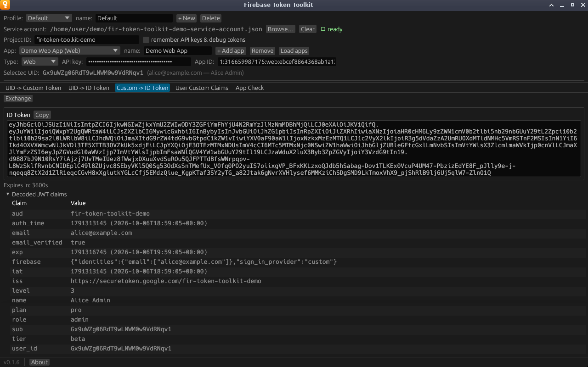

# Custom -> ID Token

Exchanges a custom token you already have for an ID token, by calling
`accounts:signInWithCustomToken`. Use it to check a custom token minted
somewhere else, such as by your own backend, or one copied from the
[UID -> Custom Token](uid-to-custom-token.md) tab.

**Needs:** an [app](../configuration.md#apps) with an API key. No service
account is required, so this tab works in a profile that only has an app's
key.

## Exchanging a token

1. Paste the token into **Custom token**.
2. Click **Exchange**.

The result shows the ID token with a **Copy** button, **Expires in**, and the
decoded claims. Claims carried in the custom token, such as `tier` above, show
up next to the ones stored on the user (`plan` and `role`).

Unlike *UID -> ID Token*, this tab does not show the refresh token.

## When the exchange fails

Errors appear in red under the button, with Google's message passed through.
The common ones:

- `INVALID_CUSTOM_TOKEN : Invalid assertion format. 3 dot separated segments required.`
  means the paste is incomplete.
- `INVALID_CUSTOM_TOKEN` with other text usually means the token has expired.
  Custom tokens last one hour.
- `CREDENTIAL_MISMATCH` means the token was signed by a different project from
  the one the API key belongs to.

See [Troubleshooting](../troubleshooting.md#tokens) for more.
