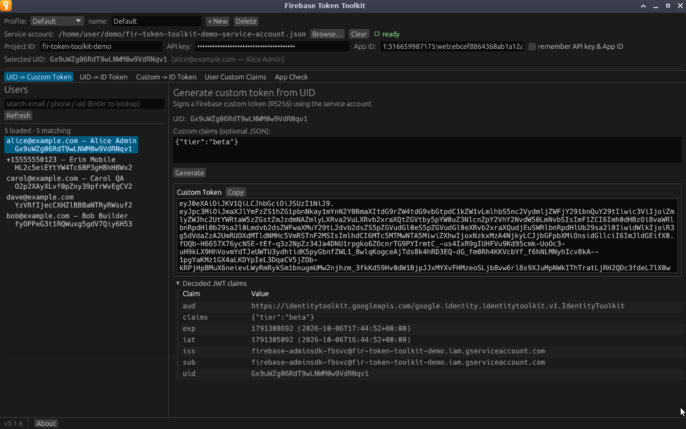

# Reading the results

Every tab presents tokens the same way.

## The token box

The token appears in a read-only, scrollable box with its name (**Custom
Token**, **ID Token** or **App Check Token**) and a **Copy** button above it.
**Copy** puts the whole token on the clipboard. If the clipboard is
unavailable, the error appears next to the button; you can still select the
text in the box and copy it with <kbd>Ctrl</kbd>+<kbd>C</kbd>
(<kbd>⌘</kbd>+<kbd>C</kbd> on macOS).

## Decoded JWT claims

Click **Decoded JWT claims** to expand a table of everything in the token's
payload, sorted by name. Values are selectable for copying.

Timestamps are shown twice, as the raw Unix time and as UTC, for example
`1791308692 (2026-10-06T17:44:52+00:00)`. That applies to `iat` (issued at),
`exp` (expires) and `auth_time` (when the user signed in). Nested values, like
the `firebase` claim in an ID token, are shown as compact JSON.

The table decodes the payload without checking the signature. It tells you
what a token says, not whether a server will accept it.

## Errors

When a request fails, the tab shows `Error:` and the message in red under its
button. Problems with the top bar or the service account show in the status
bar under the tabs instead, with a **dismiss** button. See
[Troubleshooting](../troubleshooting.md) for what the messages mean.
