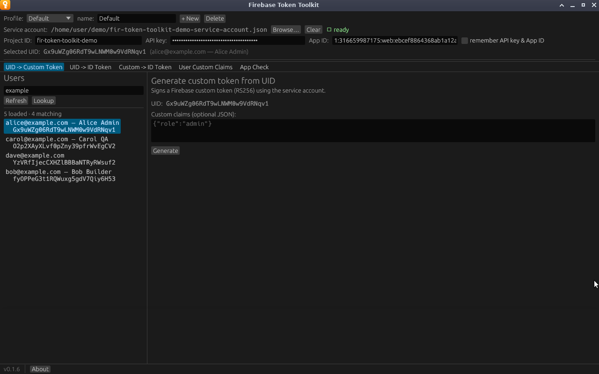

# UID -> Custom Token

Signs a Firebase [custom token](https://firebase.google.com/docs/auth/admin/create-custom-tokens)
for the selected user with your service-account key. Signing happens on your
machine; nothing is sent over the network.

**Needs:** a service account and a selected user.



## Generating a token

1. Pick a user in the [Users panel](users-panel.md).
2. Optionally, enter claims in **Custom claims (optional JSON)**.
3. Click **Generate**.

The token appears under **Custom Token** with a **Copy** button. Open **Decoded
JWT claims** to see what was signed.


A custom token is valid for one hour. It is not an ID token: a client signs in
with it, using `signInWithCustomToken` in a Firebase SDK, and receives an ID
token back. To skip that step, use [UID -> ID Token](uid-to-id-token.md).

## Adding claims to one token

Claims typed here go into the token's `claims` field and are carried into the
ID token that the custom token is exchanged for. They are not stored on the
user, so the next token you generate starts without them.

The box must hold a JSON object, such as:

```json
{"tier": "beta", "beta_features": ["new-checkout"]}
```

To give a user claims that appear in every token they receive, use [User Custom
Claims](custom-claims.md) instead.

## What the token contains

| Claim | Value |
|---|---|
| `iss`, `sub` | The service account's email address |
| `aud` | `https://identitytoolkit.googleapis.com/google.identity.identitytoolkit.v1.IdentityToolkit` |
| `uid` | The selected user's UID |
| `iat`, `exp` | Issue time, and expiry one hour later |
| `claims` | Your optional claims, if any |
