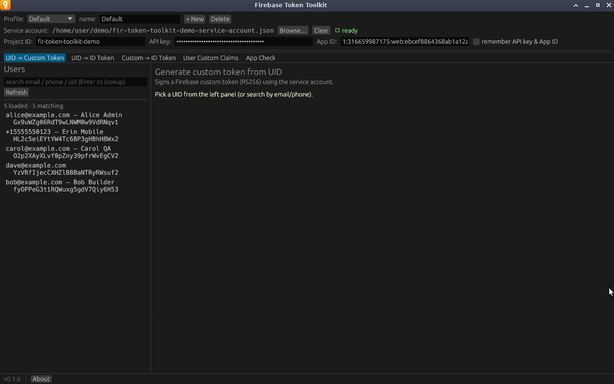
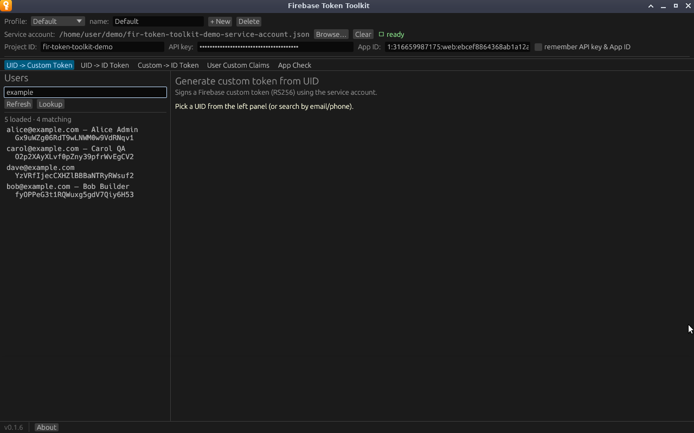
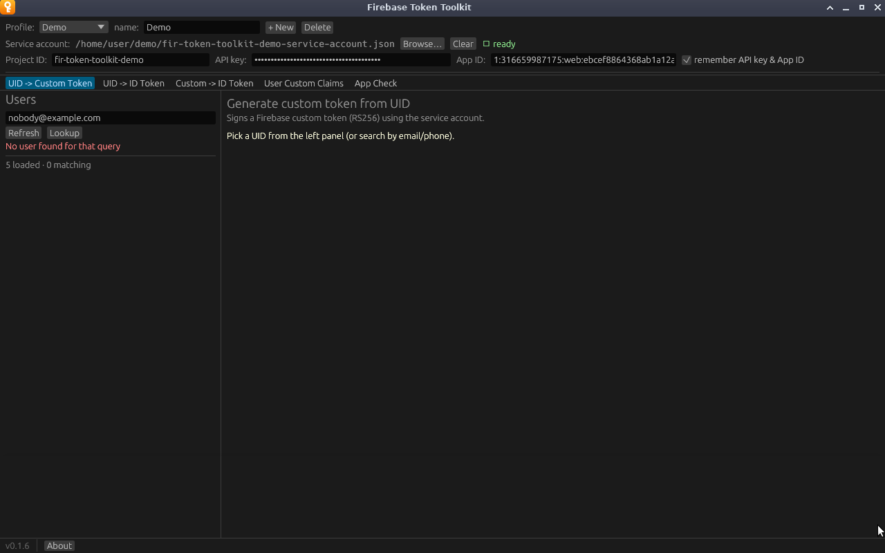

# The Users panel

The panel on the left lists the project's Firebase Authentication users so you
can pick one instead of copying UIDs around. It appears on the tabs that act on
a user: *UID -> Custom Token*, *UID -> ID Token* and *User Custom Claims*.

It needs a loaded service account and a Project ID. Without them it shows
*Load a service account and set Project ID to browse users.*

## Loading users

Click **Load users**. The app fetches users 1,000 at a time, up to 5,000 in
total, and the button becomes **Refresh**. A counter shows how many users are
loaded and how many match the search box.

Each row shows:

- the user's email, or their phone number if they have no email, or
  `(no email/phone)`,
- their display name after a dash, if they have one,
- their UID on the second line.

Click a row to select that user. The row is highlighted and the user appears
under **Selected UID** in the top bar.

## Filtering and looking up

The search box does two different things.

**Typing filters the loaded list.** Matching is case-insensitive and covers
email, phone, display name and UID, so `example` keeps every `@example.com`
user and `+1555` finds phone users. Nothing is sent to Google.

**Pressing <kbd>Enter</kbd> or clicking Lookup asks Firebase directly.** Use it
for users outside the loaded 5,000, or without loading the list at all. The
query must be a complete value, and its form decides what is searched:

| Query starts with or contains | Looked up as | Example |
|---|---|---|
| starts with `+` | Phone number | `+15555550123` |
| contains `@` | Email (case does not matter) | `alice@example.com` |
| anything else | UID | `Gx9uWZg06RdT9wLNWM0w9VdRNqv1` |

A user found this way is selected and added to the top of the list. If nobody
matches, the panel says so:

## Privacy

The list shows real personal data from your project: emails, phone numbers and
display names. Keep that in mind before sharing your screen or a screenshot.
