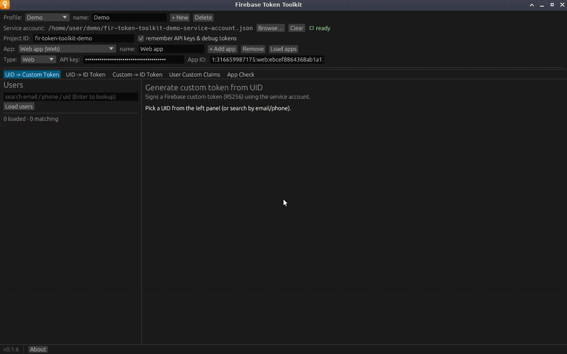

# Firebase Token Toolkit

Firebase Token Toolkit is a desktop app for getting the Firebase auth tokens
you need while developing and testing a backend. Pick a user, click
**Generate**, and you have a real ID token for that user, with its claims
decoded underneath and a **Copy** button next to it.

It covers five jobs, each on its own tab:

| Tab | What it does |
|---|---|
| [UID -> Custom Token](guide/uid-to-custom-token.md) | Signs a custom token for a user with your service-account key. |
| [UID -> ID Token](guide/uid-to-id-token.md) | Signs a custom token and immediately exchanges it, giving you an ID token in one click. |
| [Custom -> ID Token](guide/custom-to-id-token.md) | Exchanges a custom token you already have for an ID token. |
| [User Custom Claims](guide/custom-claims.md) | Reads and edits the custom claims stored on a user record. |
| [App Check](guide/app-check.md) | Exchanges an App Check debug token for an App Check token. |

A [Users panel](guide/users-panel.md) on the left lists the project's users and
searches them by email, phone or UID, so you rarely need to look a UID up by
hand. [Profiles](profiles.md) keep the settings for several Firebase projects
side by side.

The app is a single native binary for Linux, Windows and macOS. It talks only to
Google's endpoints, only when you click something, and never writes your
private key or the tokens it mints to disk.

## Where to start

1. [Install the app](installation.md).
2. [Collect what you need from your Firebase project](firebase-setup.md): a
   service-account key and the Web API key.
3. Follow the [Quick start](quick-start.md) to your first ID token.

> **Use a development project.** A service-account key can sign in as any user
> in its project, and the app shows real tokens on screen. Read the
> [Security](security.md) page before pointing it at anything that matters.
