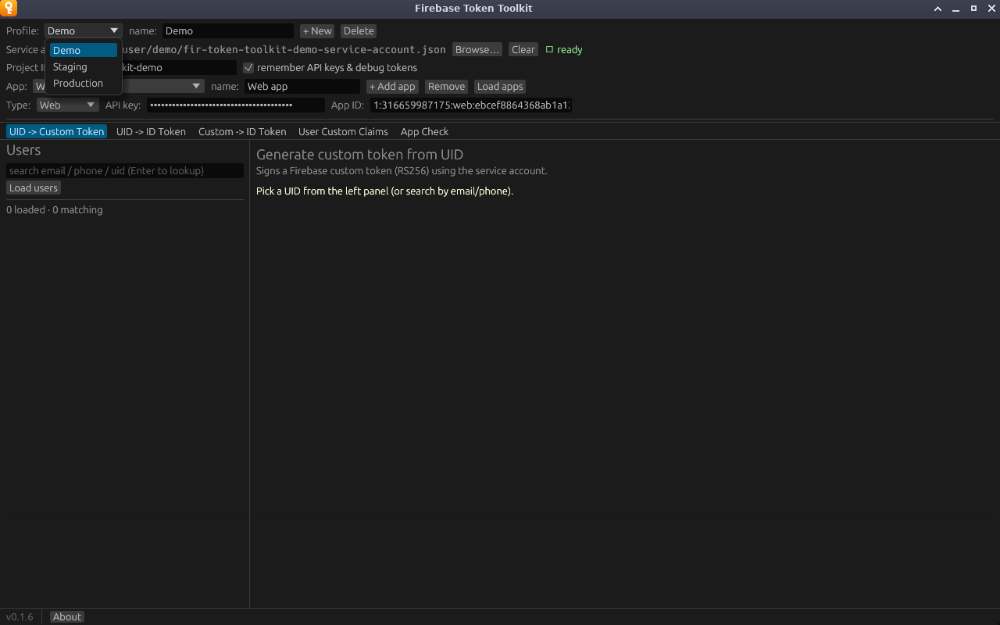

# Profiles

A profile holds one project's settings: service-account path, Project ID, and
the project's [apps](configuration.md#apps) with their API keys and App Check
debug tokens. Keep one per Firebase project, for
example *Dev*, *Staging* and *Production*, and switch between them from the
**Profile** dropdown.

## Managing profiles

| Control | What it does |
|---|---|
| **Profile** dropdown | Switches to another profile. Unnamed profiles are listed as `(unnamed #N)`. |
| **name** | Renames the active profile as you type. |
| **+ New** | Creates an empty profile called `Profile N` and switches to it. |
| **Delete** | Removes the active profile straight away, without asking first. |

If you delete the only profile, an empty `Default` profile replaces it.
**Delete** is greyed out when there is nothing to delete: a single profile with
no service account and no API key.

## What switching does

Switching profiles gives you a clean slate. The app:

- loads the new profile's service account from its saved path,
- clears the user list and the selected user,
- discards the cached OAuth access token,
- clears the output of every tab.

Nothing from one project leaks into another, so a token on screen always
belongs to the profile shown in the dropdown.

## Saving

Profile names, service-account paths, Project IDs and app lists are always
saved. API keys and debug tokens are saved only while **remember API keys &
debug tokens** is ticked, and that checkbox applies to every profile, not just
the active one. See [Settings and storage](reference/settings-storage.md).
