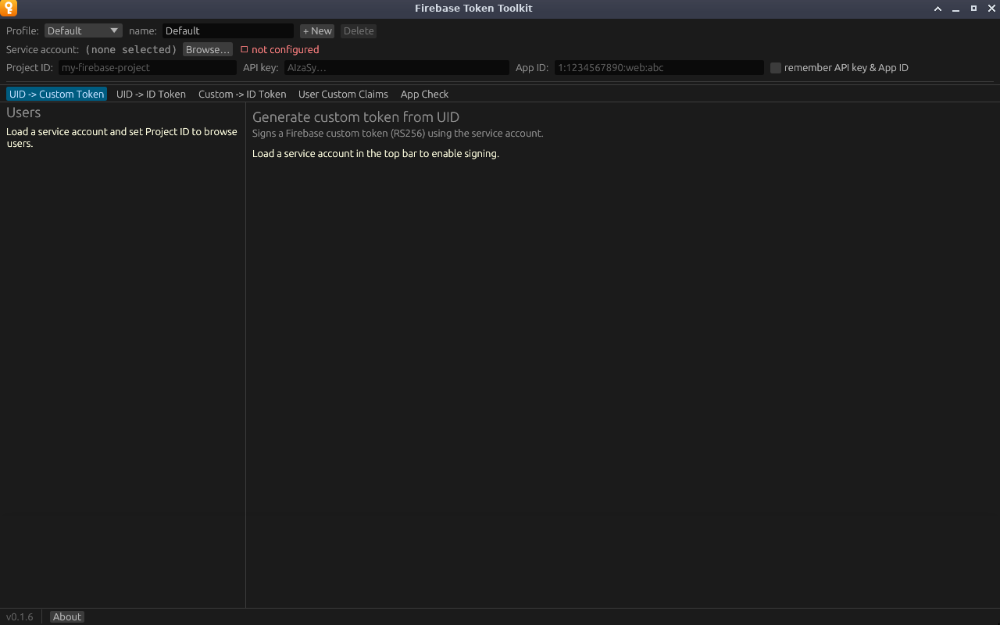
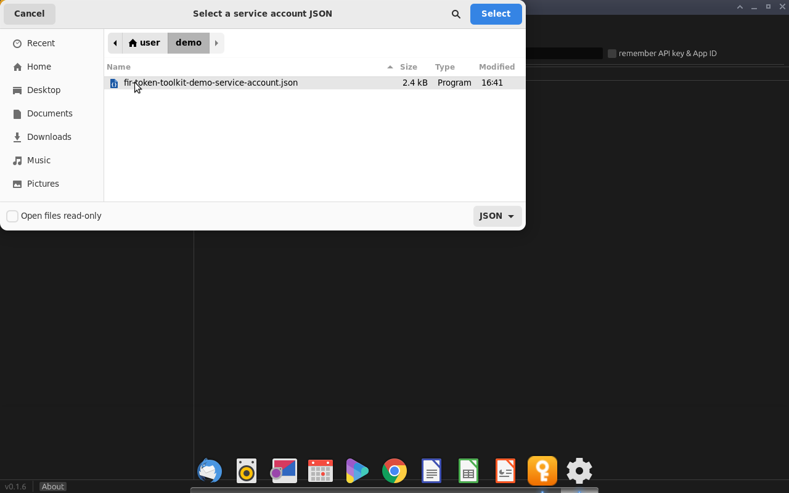
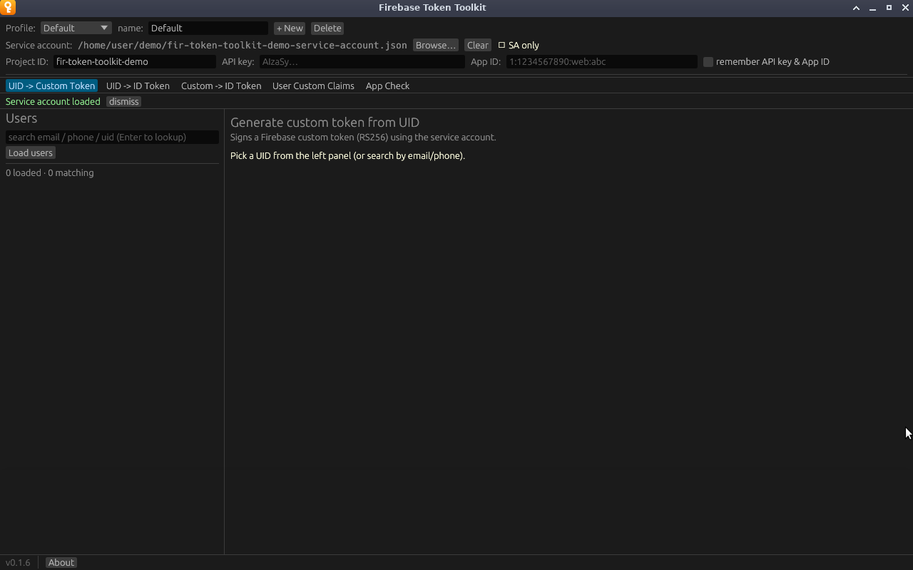
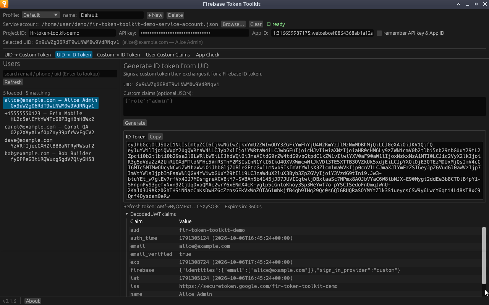

# Quick start

This walk-through goes from a fresh install to an ID token for one of your
users. You need a service-account key file and the project's Web API key; see
[Preparing your Firebase project](firebase-setup.md) if you do not have them
yet.

## 1. Open the app

On first launch the status indicator reads **not configured** in red, and the
tabs ask you to load a service account.



## 2. Load the service-account key

Click **Browse…** next to **Service account** and choose the JSON key file.



The path appears in the top bar, **Project ID** fills itself in from the key,
and the indicator changes to **SA only**. A green *Service account loaded*
message confirms it; click **dismiss** to hide it.



## 3. Enter the Web API key

Paste the Web API key into **API key**. The field is masked. The indicator
turns green and reads **ready**.

If you plan to use the App Check tab, paste the web app's **App ID** too.


## 4. Load your users

Click **Load users** in the Users panel. The app fetches up to 5,000 users and
lists each one by email (or phone number), display name and UID.


## 5. Generate an ID token

1. Click a user in the list. Their UID appears under **Selected UID** in the
   top bar.
2. Open the **UID -> ID Token** tab.
3. Click **Generate**.

The ID token appears in a box with a **Copy** button. Under it are a shortened
refresh token, the time until the token expires, and a collapsible **Decoded
JWT claims** table.



Click **Copy** and use the token wherever your backend expects one, for
example:

```bash
curl -H "Authorization: Bearer <paste token here>" https://localhost:8080/api/me
```

## 6. Keep the setup for next time

The service-account path and Project ID are saved automatically. The API key
and App ID are saved only if you tick **remember API key & App ID**; without
it, you paste them again on each launch. See
[Settings and storage](reference/settings-storage.md) for what that writes to
disk.

## Next steps

- Add [custom claims to a token](guide/uid-to-custom-token.md#adding-claims-to-one-token),
  or [store claims on the user](guide/custom-claims.md) so every token carries
  them.
- Set up [profiles](profiles.md) if you work with more than one Firebase
  project.
